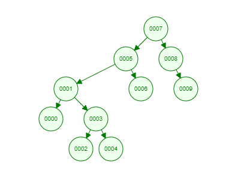

# Veri Yapıları ve Algoritmalar - Insertion Sort

## https://patika.dev 'in Binary Search Tree Projesi

## Binary Search Tree Projesi
- **[7, 5, 1, 8, 3, 6, 0, 9, 4, 2]** dizisinin Binary-Search-Tree aşamalarını yazınız.

  
## Ekran Görüntüleri

 

  
## Çözüm
- Bir düğüm iki tarafa da referans verebilir.
- Sağ tarafında kendinden büyük, sol tarafında kendinden küçük elemanlar olmalı.
-
- İlk aramaya başlamak için **Kök**ten (**x**) başlarız.